# Intellicheck — System Architecture

> Intelligent Document Verification Platform  
> OCR · Classification · Stamp Detection · Address Verification · ID Proof Validation

---

## System Overview

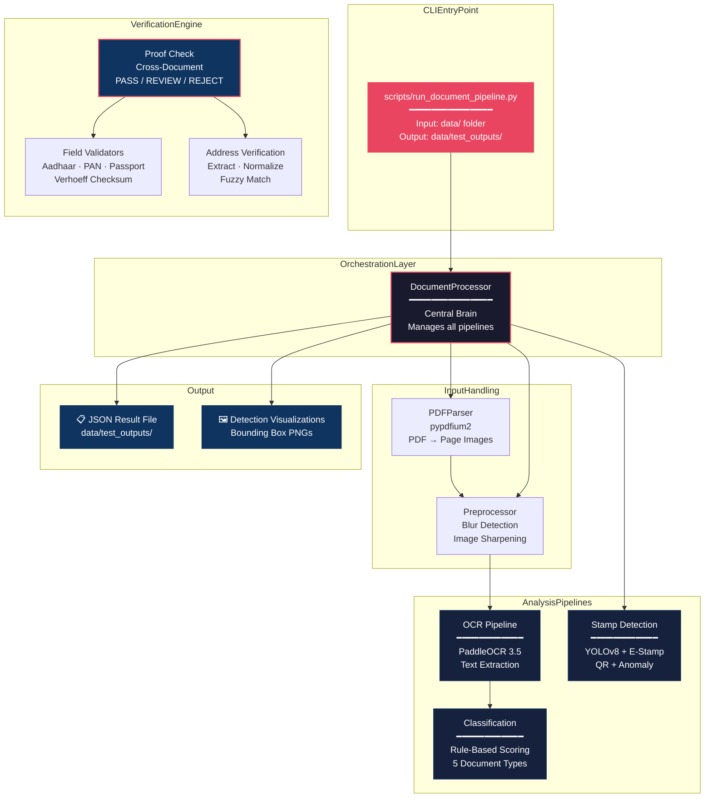

---

## Module Map

```text
app/
├── core/
│   └── config.py                        ← Feature selection, progress stages
│
├── services/
│   └── document_processor.py            ← Central orchestrator (features + progress)
│
├── document_parsing/
│   └── pdf_parser.py                    ← PDF → page images (pypdfium2, 75 DPI)
│
├── preprocessing/
│   ├── blur.py                          ← Multi-region Laplacian blur detection + sharpening
│   └── utils.py                         ← Image loading utilities (EXIF-aware)
│
├── ocr/
│   ├── engine.py                        ← PaddleOCR 3.5 wrapper (CPU, English)
│   ├── parser.py                        ← Raw OCRResult → structured blocks
│   ├── formatter.py                     ← Blocks → full text output
│   └── visualizer.py                    ← OCR bounding box visualization
│
├── classification/
│   ├── classifier.py                    ← Weighted keyword scoring engine
│   ├── document_rules.py                ← 5 document type rule configs
│   └── result.py                        ← ClassificationResult dataclass
│
├── stamp_detection/
│   ├── __init__.py                      ← Package exports (StampDetector, utils, etc.)
│   ├── detector.py                      ← YOLO orchestrator (StampDetector)
│   ├── estamp_classifier.py             ← E-stamp classifier (blur-aware OCR + scoring)
│   ├── anomaly_detector.py              ← Per-crop quality checks (faded/contrast/blur)
│   ├── qr_processor.py                  ← OpenCV QR detection & decoding
│   └── utils.py                         ← Cropping, ink check, visualization, overlap
│
├── address_verification/
│   ├── extractor.py                     ← Regex address extraction from OCR
│   ├── normalizer.py                    ← Abbreviation expansion
│   ├── matcher.py                       ← Fuzzy + containment matching
│   ├── freshness.py                     ← Document age validation
│   └── validator.py                     ← Full verification orchestrator
│
├── validation/
│   ├── validators.py                    ← Aadhaar, PAN, Passport, IFSC validators
│   └── proof_check.py                   ← Cross-doc verification → PASS/REVIEW/REJECT
│
├── pipelines/
│   ├── ocr_pipeline.py                  ← OCR orchestration
│   ├── classification_pipeline.py       ← Classification orchestration
│   └── stamp_detection_pipeline.py      ← Stamp detection orchestration
│
├── models/
│   ├── best.pt                          ← YOLO stamp/signature detection model (~22 MB)
│   └── sign_detect/                     ← Alternative signature models
│
├── storage/                             ← Storage abstraction layer (placeholder)
└── utils/                               ← Shared utility functions (placeholder)

scripts/
└── run_document_pipeline.py             ← CLI entry point (main program)
tests/
├── api/                                 ← API endpoint tests
├── classification/                      ← Classification tests
├── ocr/                                 ← OCR tests
├── pipelines/                           ← Pipeline integration tests
├── preprocessing/                       ← Preprocessing tests
├── stamp_detection/                     ← Stamp detection tests
├── test_document_verification.py        ← Cross-document verification tests
├── test_pdf_processing.py               ← PDF processing tests
├── test_validation.py                   ← Field validation tests
└── debug_pipeline.py                    ← Pipeline debugging script
```

---

## Pipeline 1: Document Processing (End-to-End)

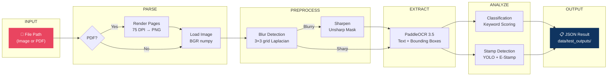

### PDF Multi-Page Handling

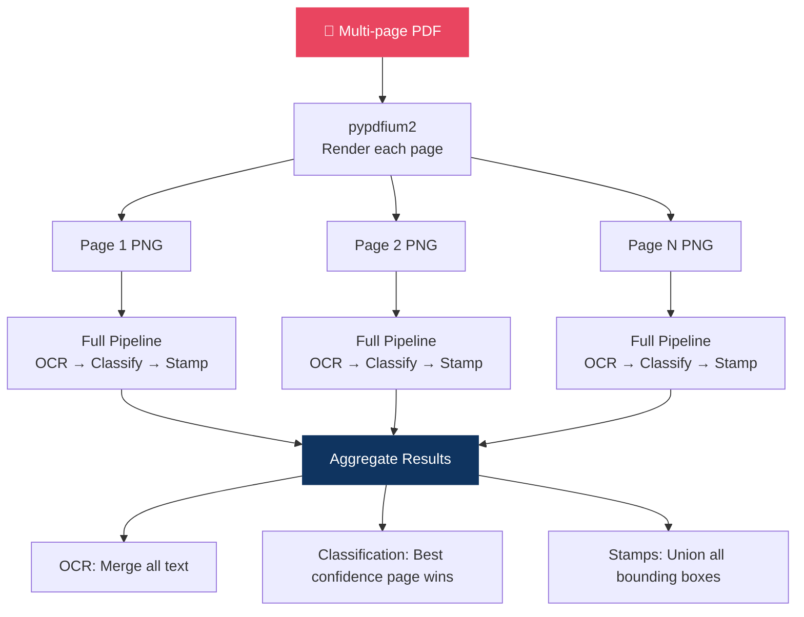

---

## Pipeline 2: OCR + Classification

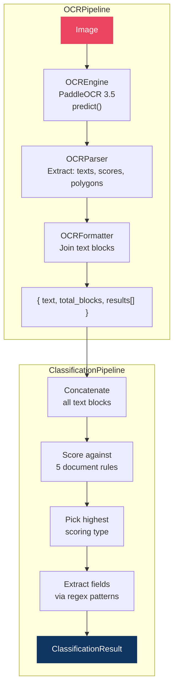

### Classification: Document Types & Scoring

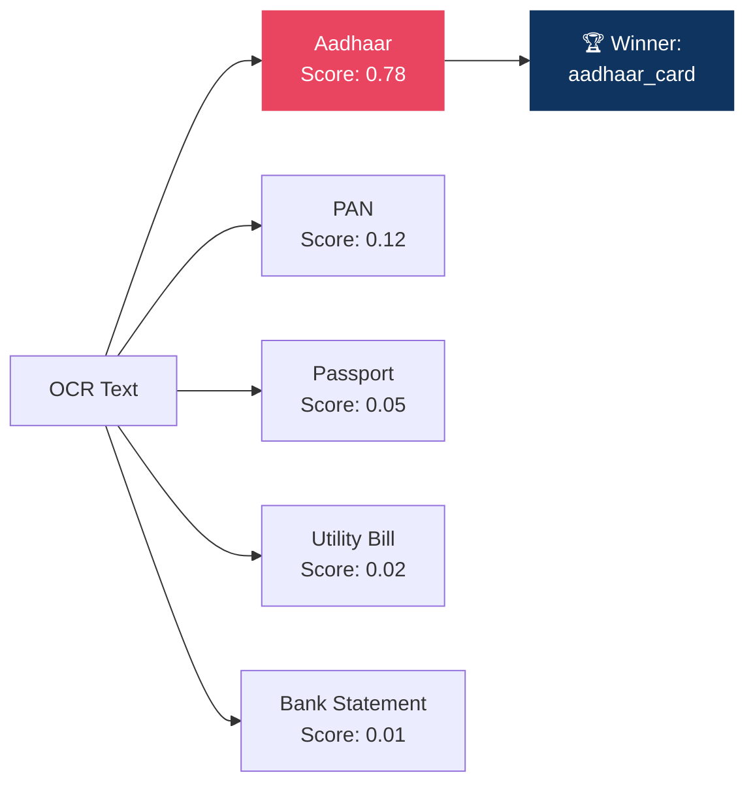

| Document | Category | Primary Keywords | Extracted Fields |
|---|---|---|---|
| **Aadhaar Card** | ID + Address | `aadhaar`, `uidai` | aadhaar_number, DOB, gender, pincode |
| **PAN Card** | ID only | `permanent account number` | pan_number, DOB |
| **Passport** | ID + Address | `passport`, `republic of india` | passport_number, DOB, issue/expiry dates |
| **Utility Bill** | Address only | `electricity bill`, `consumer number` | consumer_number, bill_date, amount |
| **Bank Statement** | Address only | `bank statement`, `ifsc` | account_number, ifsc_code, period |

### Scoring Weights

| Keyword Tier | Weight | Purpose |
|---|---|---|
| **Primary** | +3.0 | Strong identity signals (`aadhaar`, `passport`) |
| **Secondary** | +2.0 | Supporting context (`government of india`) |
| **Field Hints** | +1.0 | Weak signals (`dob`, `male`, `s/o`) |
| **Negative** | −2.0 | Disambiguation (`income tax` on Aadhaar = penalty) |

> **Confidence** = matched_score / max_possible_score  
> Below **0.15** → classified as `unknown`

---

## Pipeline 3: Stamp Detection

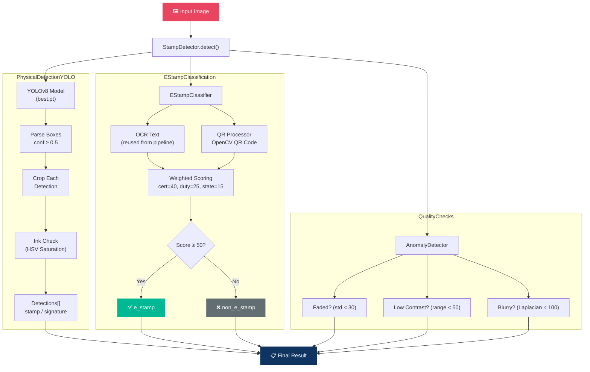

### E-Stamp Scoring Breakdown

| Signal | Points | Detection Method |
|---|---|---|
| Certificate Number | **40** | Regex: `IN-MH12345678901234` |
| Stamp Duty Amount | **25** | Regex: `Rs. 100` (needs context) |
| State Name | **15** | Match against 22 Indian states |
| Date | **10** | Multiple date formats |
| QR Decoded (data) | **5** | OpenCV QRCodeDetector |
| QR Present (visual) | **2** | Contour-based detection / detect() |
| **Threshold** | **50** | Score ≥ 50 → e-stamp confirmed |

> **Context-aware:** Stamp duty, state, and date only count if a certificate number OR e-stamp keyword was already found. Prevents false positives from generic invoices.

### QR Code Detection & Decoding Flow

The `QRProcessor` (`app/stamp_detection/qr_processor.py`) implements a streamlined QR code detection and decoding workflow designed specifically for standard QR codes using OpenCV. It avoids external barcode or DataMatrix libraries (like pylibdmtx or pyzbar) and progressive cropping loops.

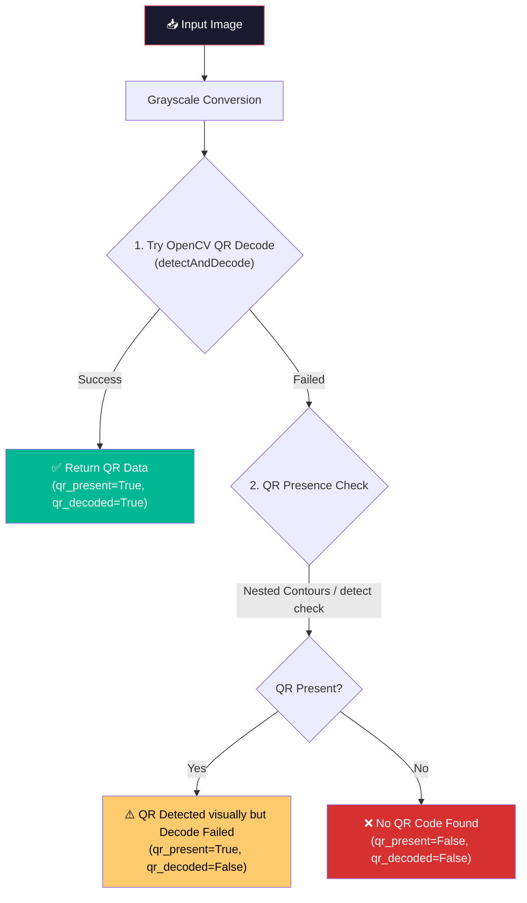

#### Detailed Decoding Priority
OpenCV's `cv2.QRCodeDetector` acts as the single unified engine for both QR presence detection and payload decoding.

#### OpenCV QR Presence Logic Check
To identify the presence of a QR code even when it is too blurry or distorted to decode, the processor performs a two-layered check:
1. **Contour-Based Finder Pattern Search:**
   It uses adaptive thresholding and hierarchical contour scanning to locate nested square-like structures (the typical finder patterns located at three corners of a standard QR code). If at least 2 candidate finder patterns are located, the QR presence flag is raised.
2. **OpenCV built-in detect Check:**
   If contour analysis fails, a direct fallback to `cv2.QRCodeDetector().detect()` is performed to double check if a QR code boundary is recognized.

---

## Pipeline 4: Address Verification

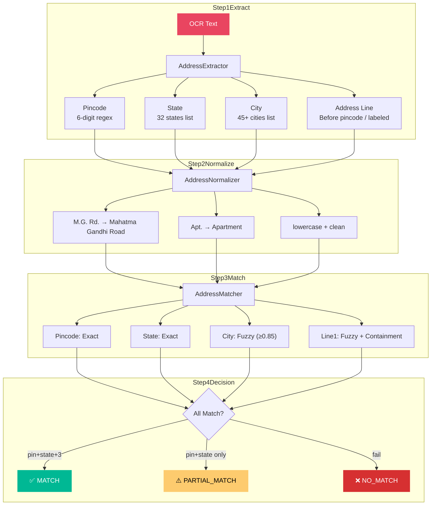

### Freshness Rules

| Document Type | Maximum Age | Notes |
|---|---|---|
| Utility Bill | 90 days | Electricity, water, gas, phone |
| Bank Statement | 90 days | Account statement |
| Rental Agreement | 180 days | Lease agreement |
| Aadhaar / Passport / DL | 10 years | Government-issued IDs |

---

## Pipeline 5: ID Proof Validation & Final Verdict

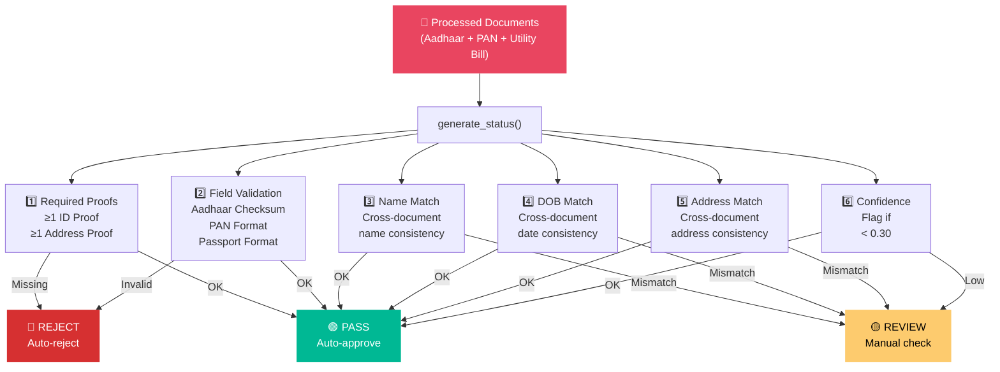

### Proof Categories

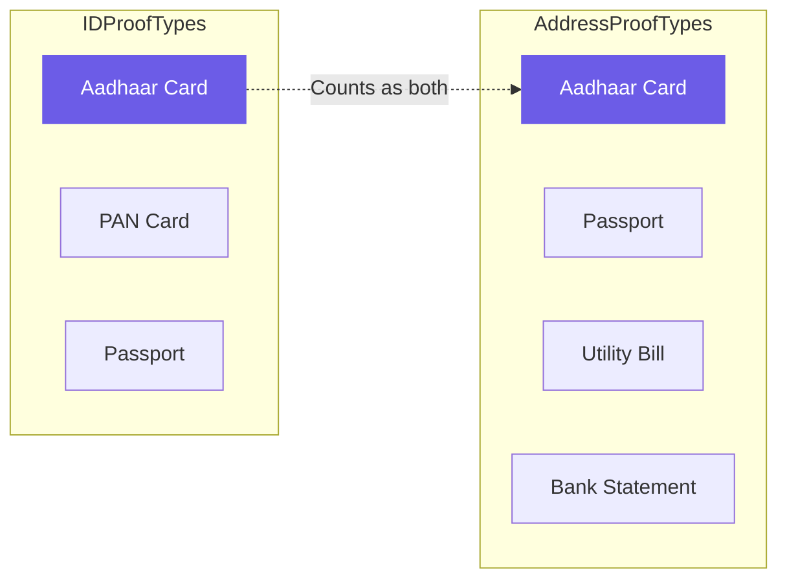

> **Aadhaar** is the only document that counts as **both** ID proof and Address proof.

### Field Validators

| Validator | Format | Special Check |
|---|---|---|
| **Aadhaar** | 12 digits, starts 2-9 | **Verhoeff checksum** (UIDAI algorithm) |
| **PAN** | `ABCDE1234F` | 4th char must be valid holder type |
| **Passport** | `A1234567` | 1 letter + 7 digits |
| **Pincode** | 6 digits | Starts with 1-9 |
| **IFSC** | `XXXX0XXXXXX` | 4 letters + 0 + 6 alphanumeric |
| **Date** | `DD/MM/YYYY` | Must not be in future |

### Verdict Decision Tree

```text
┌──────────────────────────────────────────────────┐
│              generate_status(docs)                │
│                                                  │
│  Missing ID/Address proof?     ──YES──→  REJECT  │
│  Invalid field (checksum)?     ──YES──→  REJECT  │
│  ─────────────────────────────────────────────── │
│  Name mismatch across docs?    ──YES──→  REVIEW  │
│  DOB mismatch across docs?     ──YES──→  REVIEW  │
│  Address mismatch across docs? ──YES──→  REVIEW  │
│  Low classification confidence?──YES──→  REVIEW  │
│  ─────────────────────────────────────────────── │
│  Everything OK?                ──YES──→  PASS    │
└──────────────────────────────────────────────────┘
```

---

## Data Flow: Input → Output

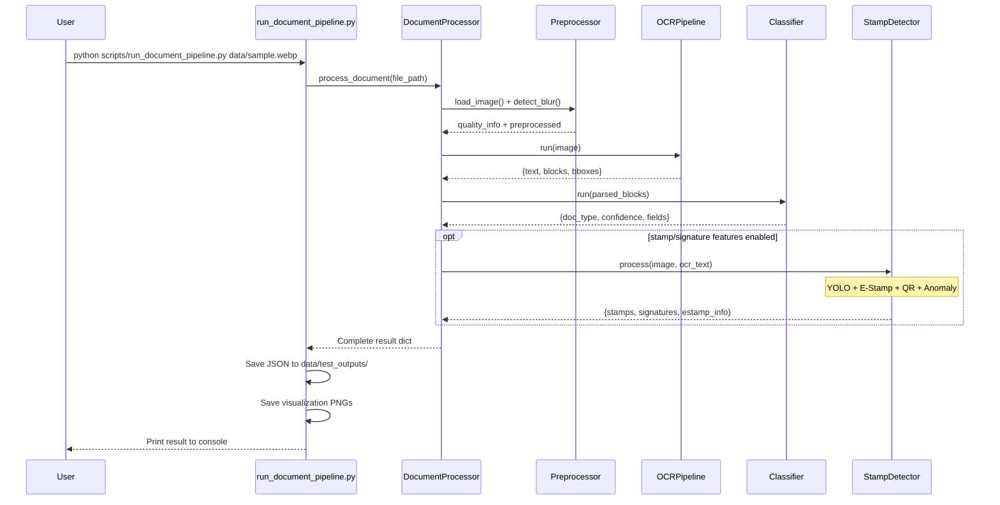

---

## Shared Resource: OCR Engine

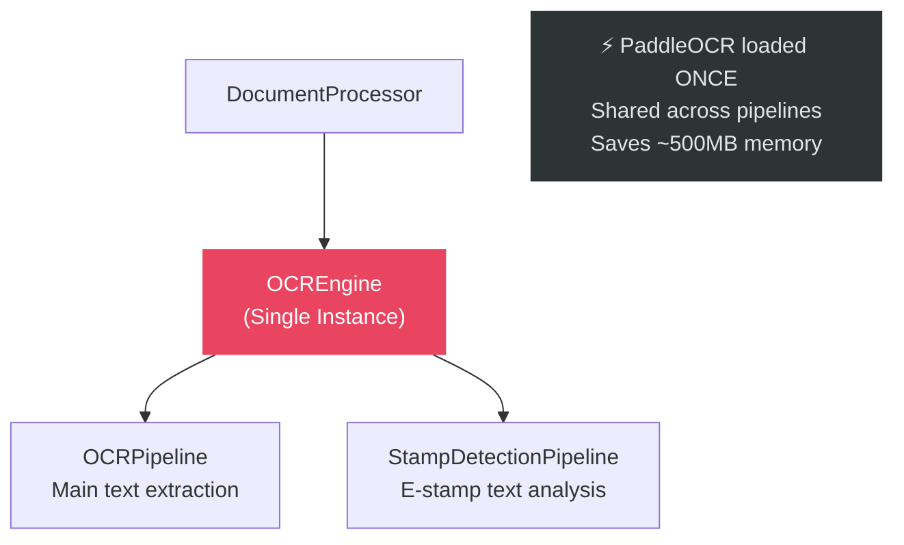

---

## Technology Stack

| Layer | Technology | Purpose |
|---|---|---|
| **OCR** | PaddleOCR 3.5 | Text extraction from images |
| **Object Detection** | YOLOv8 (Ultralytics 8.3) | Stamp & signature localization |
| **Deep Learning** | PyTorch 2.12 + Torchvision | YOLO model runtime |
| **PDF Parsing** | pypdfium2 | PDF page rendering |
| **QR Code** | OpenCV | QR detection & decoding |
| **Image Processing** | OpenCV + NumPy + Pillow | Blur detection, sharpening, cropping, ink analysis |
| **Field Validation** | Pure Python | Verhoeff checksum, regex, fuzzy matching |
| **HTTP Client** | Requests | E-stamp authority verification (optional) |

---

## Program Execution Flow — Stamp Detection

Below is the step-by-step program execution flow specifically for the stamp detection system when processing a document:

```mermaid
sequenceDiagram
    autonumber
    actor User as User
    participant CLI as run_document_pipeline.py
    participant DP as DocumentProcessor
    participant PDF as PDFParser (pypdfium2)
    participant PRE as Preprocessor (OpenCV)
    participant OCR as OCRPipeline (PaddleOCR)
    participant CLS as ClassificationPipeline
    participant SDP as StampDetectionPipeline
    participant DET as StampDetector (YOLOv8)
    participant ESC as EStampClassifier
    participant QR as QRProcessor

    User->>CLI: python scripts/run_document_pipeline.py data/estamp2.pdf
    CLI->>DP: process_document(file_path)

    alt File is PDF
        DP->>PDF: parse(pdf_path)
        PDF-->>DP: Rendered Page PNGs
        Note over DP: Loop through each page
    end

    DP->>PRE: Preprocessing (Grayscale + Laplacian Blur Check)
    PRE-->>DP: Preprocessed Image (Sharpened if blurry)

    DP->>OCR: Run OCR (PaddleOCR)
    OCR-->>DP: Extracted Text & Blocks

    DP->>CLS: Run Document Classification
    CLS-->>DP: Doc Type (Aadhaar/PAN/Passport...)

    DP->>SDP: process(image, ocr_text)
    
    rect rgb(26, 32, 53)
        note right of SDP: Stamp Detection Flow (Independent)
        SDP->>DET: detect(image, ocr_text)
        
        DET->>DET: Run YOLOv8 Model (best.pt)
        Note over DET: Detects physical 'stamps' and 'signatures'
        
        DET->>ESC: classify(image, ocr_text)
        Note over ESC: Checks Certificate regex, state names, stamp duty
        
        ESC->>QR: Decode QR
        QR-->>ESC: Decoded QR Data (matches certificate?)
        ESC-->>DET: E-Stamp Score (>= 50 is e-stamp)
        
        DET->>DET: Run Anomaly Checks on crops (Faded / Contrast / Blur)
        DET-->>SDP: Combined Stamp Detection Results
    end

    SDP-->>DP: Serializable JSON (stamps, signatures, anomalies, e-stamp details)
    
    alt File is PDF
        Note over DP: Aggregate results across all pages
    end

    DP-->>CLI: Full Processing Result Dict
    CLI->>CLI: Save JSON + Visualization PNGs
    CLI-->>User: Print result to console
```

### Flow Breakdown

1. **Input:** The user runs the CLI script with a file path from the `data/` folder.
2. **Format Check:**
   - **If PDF:** `PDFParser` renders pages as temporary PNGs. Each page is processed sequentially, and the final results are aggregated.
   - **If Image:** OpenCV loads the image directly.
3. **Image Preprocessing:** Checks for blur. If blurry, runs OpenCV sharpening (Unsharp Mask).
4. **OCR & Document Classification:** PaddleOCR extracts text blocks, which the `ClassificationPipeline` scores to identify the document type.
5. **Stamp Detection Core:**
   - **YOLOv8** localizes physical stamps and signatures.
   - **EStampClassifier** uses OCR regex rules and runs the **QRProcessor** (using OpenCV) to locate/decode QR codes. An e-stamp score >= 50 confirms it as an e-stamp.
   - **Anomaly Detector** flags any physical detections that are faded, blurry, or low-contrast.
6. **Output:** Results are saved as JSON to `data/test_outputs/` and visualization PNGs are saved alongside.

---

## How to Run

### Prerequisites

| Requirement | Notes |
|-------------|-------|
| **Python 3.10+** | Tested on 3.10–3.12 |

### Install Dependencies

```bash
python -m venv venv
.\venv\Scripts\Activate.ps1
pip install -r requirements.txt
```

### Run the Pipeline

```bash
# Process a PDF
python scripts/run_document_pipeline.py data/estamp2.pdf

# Process an image
python scripts/run_document_pipeline.py data/sample.webp

# Custom output path
python scripts/run_document_pipeline.py data/sample.webp -o data/test_outputs/custom_result.json
```

Output is automatically saved to `data/test_outputs/`.
