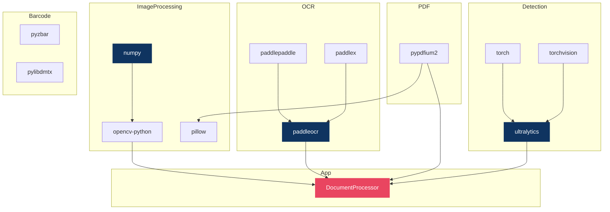

# Intellicheck — Package Dependencies & Rationale

> Complete reference of every dependency, why it was chosen, and what it does in the system.

---

## Core Image Processing

| Package | Version | Module(s) Using It | Purpose & Rationale |
|---------|---------|---------------------|---------------------|
| **numpy** | 1.26.4 | `preprocessing/`, `stamp_detection/`, `ocr/` | Foundation for all image data — OpenCV, PaddleOCR, and PyTorch all use NumPy arrays as the primary image representation. Provides the Laplacian variance blur scoring (`np.median`, `np.std`), HSV ink ratio calculations, and array manipulation for cropping. Pinned to 1.26.x for compatibility with both PaddlePaddle and PyTorch. |
| **opencv-python** | 4.10.0.84 | `preprocessing/blur.py`, `preprocessing/utils.py`, `ocr/visualizer.py`, `stamp_detection/utils.py`, `stamp_detection/qr_processor.py`, `stamp_detection/anomaly_detector.py` | The single most-used library in the project. Handles: image loading (`imread`), color space conversion (`cvtColor BGR→HSV/Gray`), blur detection (Laplacian), image sharpening (Unsharp Mask via `GaussianBlur` + `addWeighted`), QR code detection/decoding (`QRCodeDetector`), contour analysis for QR presence, bounding box visualization (`rectangle`, `polylines`, `putText`), and stamp ink analysis via HSV masking (`inRange`). Chosen over PIL/scikit-image because OpenCV provides GPU-ready image processing, QR decoding, and YOLO-compatible I/O in a single library. |
| **pillow** | 12.2.0 | `document_parsing/pdf_parser.py` | Used exclusively by `pypdfium2` to convert rendered PDF bitmaps to PIL images, which are then saved as temporary PNG files for OCR. Not used directly in image processing — OpenCV handles all pixel-level operations. |
| **requests** | 2.34.2 | `stamp_detection/utils.py` | Optional HTTP client for e-stamp certificate verification against government APIs (Maharashtra, Gujarat, Karnataka, etc.). The `verify_estamp_with_authority()` method makes POST requests to state-specific verification endpoints. Currently a placeholder — no API keys are configured by default. |

---

## PDF Processing

| Package | Version | Module(s) Using It | Purpose & Rationale |
|---------|---------|---------------------|---------------------|
| **pypdfium2** | 5.9.0 | `document_parsing/pdf_parser.py` | Renders PDF pages to images at 75 DPI for OCR processing. Chosen over PyMuPDF/fitz (GPL-licensed) and pdf2image (requires external Poppler binaries). pypdfium2 is a pure-Python binding to Google's PDFium engine — no system dependencies, permissive license, fast rendering. Each page is rendered as a PIL image, saved as a temporary PNG, and cleaned up after processing. |

---

## OCR (Optical Character Recognition)

| Package | Version | Module(s) Using It | Purpose & Rationale |
|---------|---------|---------------------|---------------------|
| **paddleocr** | 3.5.0 | `ocr/engine.py`, `stamp_detection/estamp_classifier.py` | High-level OCR API that wraps PaddlePaddle's text detection + recognition models. Chosen over Tesseract (lower accuracy on Indian documents) and Google Cloud Vision (requires API key + network). PaddleOCR 3.5 provides built-in orientation correction, text line detection, and multi-language recognition. Runs entirely offline on CPU. The `predict()` API returns text strings, confidence scores, and bounding polygons. |
| **paddlepaddle** | 3.3.1 | Transitive (used by paddleocr) | Deep learning framework that powers PaddleOCR's neural network models. Provides the inference runtime for text detection (DB++) and text recognition (SVTR) models. CPU-only configuration (`device='cpu'`). |
| **paddlex** | 3.5.2 | Transitive (used by paddleocr) | PaddlePaddle's model deployment toolkit. Manages model downloading, caching, and serving for PaddleOCR. Handles automatic model version management. |

---

## Stamp & Signature Detection

| Package | Version | Module(s) Using It | Purpose & Rationale |
|---------|---------|---------------------|---------------------|
| **torch** | 2.12.0 | `stamp_detection/detector.py` | PyTorch runtime for YOLOv8 model inference. Provides tensor operations, model loading (`torch.load`), and CPU inference. The project patches `torch.load` to set `weights_only=False` for compatibility with Ultralytics model files. CPU-only — no CUDA required. |
| **torchvision** | 0.27.0 | Transitive (used by ultralytics) | Provides image transforms and model utilities used internally by the Ultralytics YOLO implementation. Not called directly in project code. |
| **ultralytics** | 8.3.0 | `stamp_detection/detector.py` | YOLOv8 object detection framework. Loads the custom-trained `best.pt` model (22 MB) that detects two classes: `stamp` and `sign` (signature). Provides the `YOLO()` class for model loading and the `model()` call for inference, returning bounding boxes with confidence scores. Chosen because YOLOv8 is state-of-the-art for real-time object detection with excellent accuracy on small objects like stamps and signatures. |

---

## Barcode & QR Code Processing

| Package | Version | Module(s) Using It | Purpose & Rationale |
|---------|---------|---------------------|---------------------|
| **pyzbar** | 0.1.9 | Listed in requirements | Python wrapper for the ZBar barcode library. Can decode 1D and 2D barcodes including QR codes. Currently listed as a dependency but the active QR processing uses OpenCV's built-in `QRCodeDetector` instead (see `stamp_detection/qr_processor.py`). Retained for potential future use with non-standard barcode formats. |
| **pylibdmtx** | 0.1.3 | Listed in requirements | Python wrapper for the libdmtx Data Matrix barcode library. Some Indian e-stamp certificates use Data Matrix codes instead of QR codes. Currently listed as a dependency but not actively imported — the system uses OpenCV for QR detection. Retained for potential Data Matrix support. |

> **Note:** The active QR detection pipeline (`qr_processor.py`) uses OpenCV exclusively. `pyzbar` and `pylibdmtx` are retained as optional fallback dependencies.

---

## Testing

| Package | Version | Module(s) Using It | Purpose & Rationale |
|---------|---------|---------------------|---------------------|
| **pytest** | 9.0.2 | `tests/` | Python testing framework. Used for all unit tests (`test_validation.py`, `test_cross_validation.py`) and integration tests. Provides test discovery, fixtures, assertions, and detailed failure reports. Chosen over unittest for its simpler syntax and better output formatting. |

---

## Standard Library Dependencies (No Installation Required)

These Python standard library modules are used extensively but require no pip install:

| Module | Used In | Purpose |
|--------|---------|---------|
| **re** | `classification/`, `validation/`, `address_verification/`, `stamp_detection/` | Regular expressions for field extraction (Aadhaar numbers, PAN format, dates, certificate numbers, stamp duty values), keyword pattern matching, and text normalization. |
| **logging** | All modules | Structured logging throughout the pipeline. Each module creates its own logger via `logging.getLogger(__name__)`. |
| **os** | `services/document_processor.py`, `stamp_detection/detector.py` | File path operations, temp file cleanup, extension detection, directory creation. |
| **uuid** | `services/document_processor.py` | Generates unique document IDs (`uuid4()`) when not provided by the caller. |
| **tempfile** | `services/document_processor.py`, `document_parsing/pdf_parser.py` | Creates temporary files for PDF page images and byte-stream document processing. |
| **dataclasses** | `classification/result.py`, `document_parsing/pdf_parser.py` | `@dataclass` for `ClassificationResult` and `PDFPageImage` — clean data containers with automatic `__init__`, `__repr__`, and `__eq__`. |
| **datetime** | `validation/validators.py`, `address_verification/freshness.py` | Date parsing for field validation (must not be future) and document freshness checks (utility bills must be < 90 days old). |
| **difflib** | `address_verification/matcher.py` | `SequenceMatcher` for fuzzy string matching between customer and document addresses. Provides a similarity ratio (0.0–1.0) without external NLP dependencies. |
| **urllib.parse** | `stamp_detection/estamp_classifier.py` | Parses QR code payloads that contain verification URLs. Extracts certificate numbers from URL query parameters. |
| **json** | `scripts/run_document_pipeline.py` | Serializes pipeline results to JSON output files. |
| **argparse** | `scripts/run_document_pipeline.py` | CLI argument parsing for the pipeline runner script. |
| **cv2** (OpenCV) | Listed above | Listed separately because it's an external package. |

---

## Dependency Graph

---

## Version Compatibility Notes

| Constraint | Reason |
|------------|--------|
| `numpy==1.26.4` | Must be < 2.0 for PaddlePaddle 3.x compatibility. NumPy 2.0 changed C API and breaks PaddlePaddle. |
| `torch==2.12.0` | Matches `ultralytics==8.3.0` requirements. The project patches `torch.load` for PyTorch 2.6+ security changes (`weights_only` default changed to `True`). |
| `paddleocr==3.5.0` + `paddlepaddle==3.3.1` | Must use matching versions. PaddleOCR 3.5 requires PaddlePaddle 3.x. |
| `opencv-python==4.10.0.84` | Any 4.x should work. The project uses `QRCodeDetector` (available since OpenCV 4.0) and `IMREAD_IGNORE_ORIENTATION` (available since OpenCV 3.4). |
